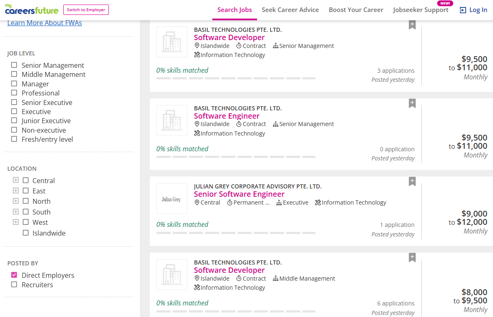
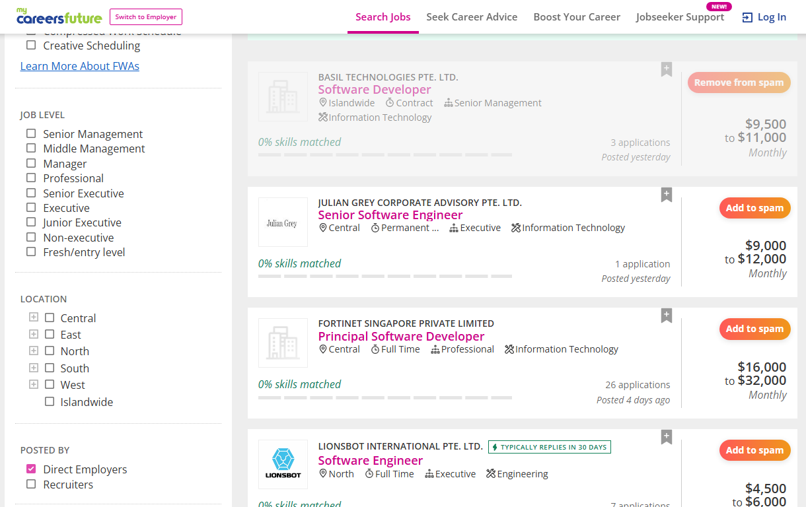
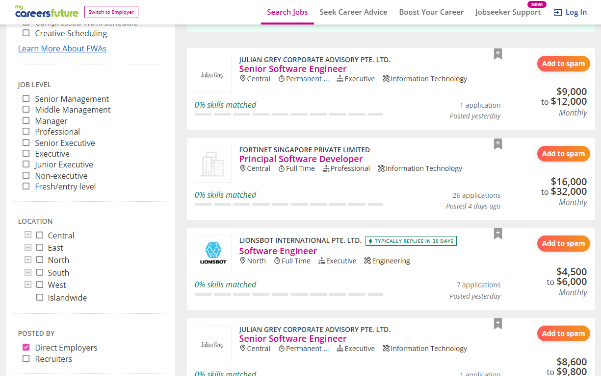
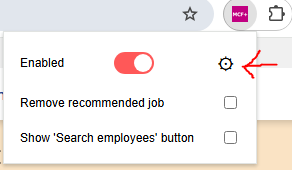
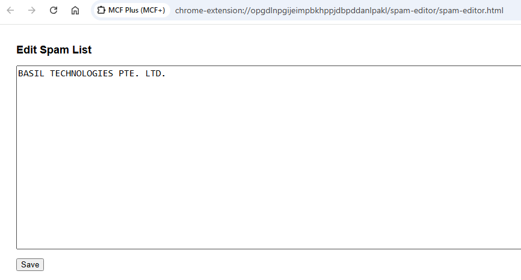
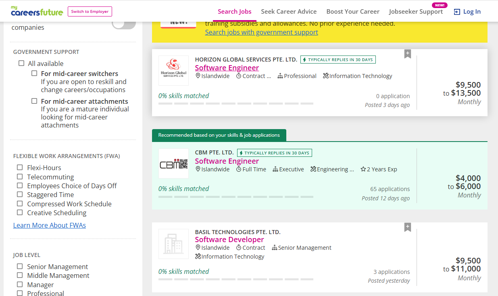
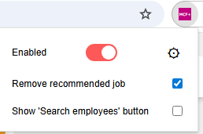
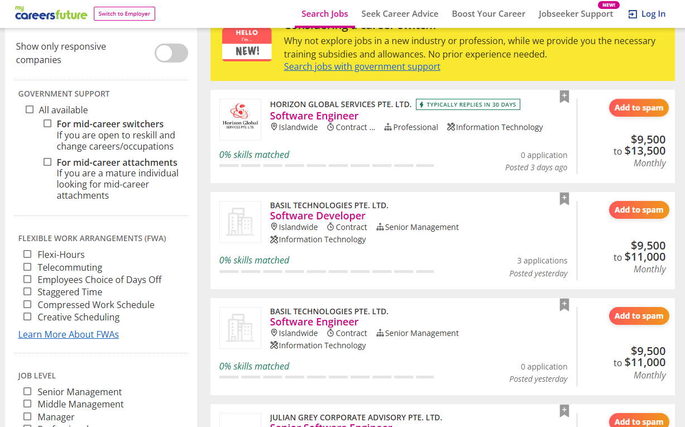

# MCF-Plus
**MyCareersFuture Plus (MCF+)** is a browser extension that enhances the job search experience on [MyCareersFuture.gov.sg](https://www.mycareersfuture.gov.sg).

---

## 🚫 Employment Agencies & Spam

### Problem: Spam listings still appear even with **“Posted by Direct Employers”** selected

### Solution: "Add to Spam"
Easily hide spam listings by adding them to your spam list.

### Result: Hidden automatically on next page load
Spam listings will no longer appear when you browse again.

### Manage your Spam List
Easily edit or remove entries from the spam list.
  

---

## 🗑️ Remove Unwanted Features

### Problem: Unnecessary “Recommended Jobs” shown

### Solution: Remove Recommended Jobs
  

---

## 🔧 Installation (Chrome)

1. Go to the [Releases](./releases) section of this repository.
2. Download the latest `.zip` file (e.g., `MCF-Plus-vX.X.X.zip`).
3. Extract the contents of the zip file to a folder on your computer.
4. Open **Google Chrome** and navigate to  
   `chrome://extensions/`
5. Enable **Developer mode** (toggle in the top-right corner).
6. Click **Load unpacked**.
7. Select the folder where you extracted the extension.
8. The extension should now appear in your Chrome extensions list.

---

## 💬 Discussions / Share your spam list

Chat or share your spam list. Join the discussion:  
👉 [Discussion Thread #1](https://github.com/dbghelp/MCF-Plus/discussions/1)

---

## 📌 Notes
- MCF+ is not affiliated with MyCareersFuture.gov.sg.
- Built to improve productivity and reduce clutter during job searches.
